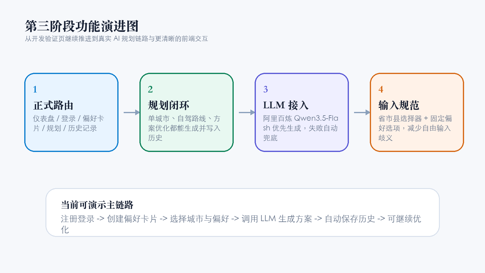
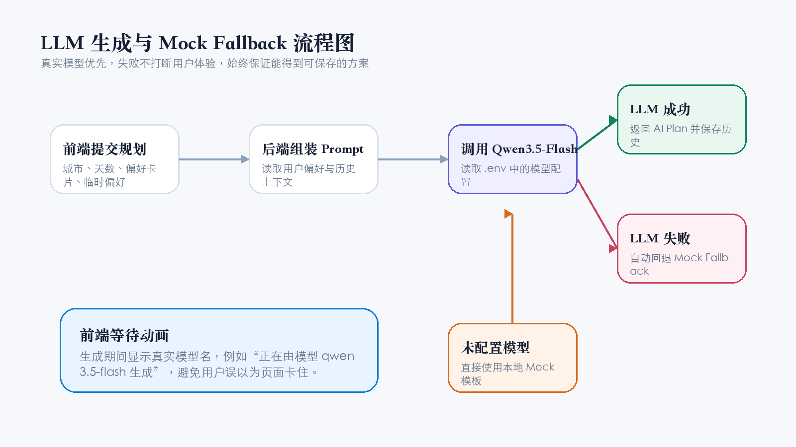
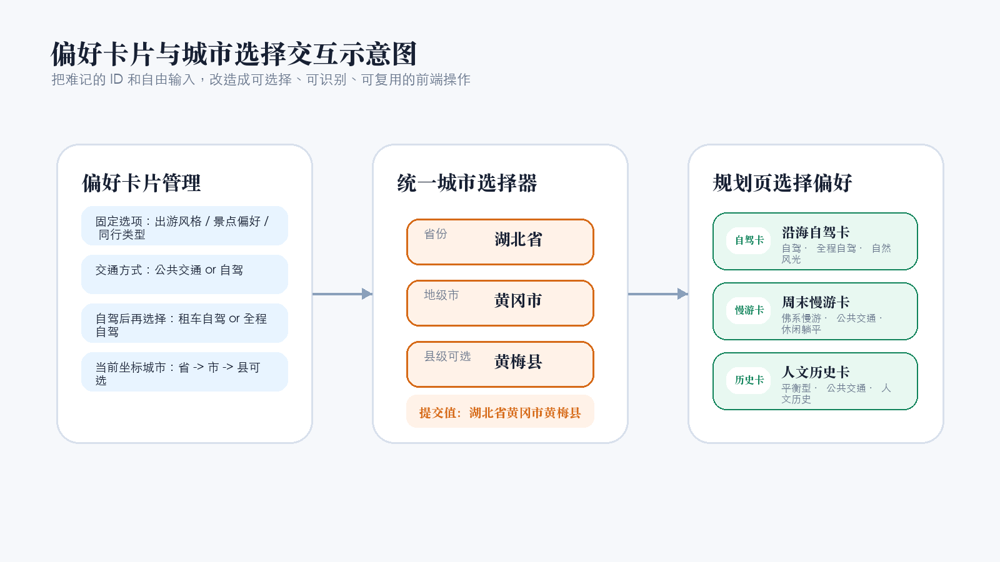

# 第三阶段工作小结

## 前言

第三阶段的开发重点，是把项目从“Mock 功能可演示”继续推进到“真实 AI 规划链路可用、前端交互更接近正式产品”的状态。

第二阶段已经完成了用户注册登录、JWT 登录态、偏好卡片、历史记录、单城市 Mock 规划等基础能力。本阶段在这些能力之上继续扩展，主要完成了前端正式路由、多城市自驾路线、方案优化、阿里百炼 Qwen3.5-Flash 接入、LLM 等待动画、省市县城市选择器、偏好卡片固定选项和偏好卡片可视化选择等工作。

当前项目已经不只是“能跑起来的骨架”，而是具备了相对完整的演示链路：用户可以登录、创建偏好卡片、选择规范城市、调用真实大模型生成单城市或自驾路线方案、自动保存历史记录，并在已有历史记录基础上继续生成优化版方案。



## 1. 本阶段工作内容

### 1.1 前端正式路由与基础布局

本阶段首先对前端页面结构进行了整理。此前项目主要是一个较长的单页验证界面，所有功能都堆在一个页面里，适合早期联调，但随着功能增加，页面会越来越难维护。

本阶段引入前端路由，把页面拆成多个清晰入口：

- `/`：仪表盘页面，用于查看项目当前状态。
- `/auth`：注册与登录页面。
- `/cards`：偏好卡片管理页面。
- `/plan/city`：单城市规划页面。
- `/plan/drive`：多城市自驾路线页面。
- `/plan/optimize`：方案优化页面。
- `/history`：历史记录页面。

同时新增了基础布局组件，统一展示项目标题、导航入口、当前登录用户状态和退出登录按钮。登录态恢复、退出登录、token 失效处理、规划生成后刷新历史记录等跨页面状态仍然集中在应用入口中维护。

这一步的价值在于，项目从“开发验证页”开始向“正式产品结构”过渡。用户现在可以通过 URL 明确知道自己在哪个功能页面，后续继续扩展页面时也不会让 `App.tsx` 无限膨胀。

### 1.2 多城市自驾路线 Mock 闭环

在单城市规划闭环完成后，本阶段继续实现了多城市自驾路线规划能力。后端新增了受 JWT 保护的接口：

```http
POST /api/plan/drive
```

该接口支持出发城市、目的城市、途经城市、旅行天数、偏好卡片、临时偏好和天气模式等输入。生成成功后，系统会自动创建一条历史记录，`recordType` 使用 `multi-city-drive-plan`。

前端新增了自驾路线规划页面，支持用户选择出发城市、目的城市，并添加多个途经城市。途经城市支持动态增删，每个城市都使用统一的省市县选择方式。

这一步让项目从“只支持一个城市攻略”扩展到“可以表达多城市路线”的能力，为后续真实地图、距离估算、驾驶时间控制等能力留下了接口和页面基础。

### 1.3 方案优化 Mock 闭环

本阶段还新增了方案优化能力。后端新增接口：

```http
POST /api/plan/optimize
```

用户输入已有历史记录 ID 和优化要求后，后端会读取原历史记录内容，生成一份新的优化版方案，并把优化结果作为新的历史记录保存。原方案不会被覆盖。

这种设计有两个好处：

- 用户可以保留原方案和优化方案，方便对比。
- 后续真实大模型接入后，可以直接复用同一条“读取历史记录 -> 生成优化内容 -> 新建历史记录”的链路。

前端也新增了方案优化页面。当前仍然通过手动输入历史记录 ID 来选择原方案，这是开发阶段的最小入口。后续可以升级为在历史记录详情中点击“优化此方案”，自动带入对应记录。

### 1.4 接入阿里百炼 Qwen3.5-Flash

本阶段的重要进展，是把项目从纯 Mock 规划推进到真实大模型生成。后端新增了 LLM 服务封装，使用阿里百炼兼容 OpenAI 的调用方式接入 `qwen3.5-flash`。

大模型配置从后端 `.env` 中读取，主要包括：

- `DASHSCOPE_API_KEY` 或兼容的 LLM API Key。
- `LLM_BASE_URL`。
- `LLM_MODEL`。
- `LLM_TIMEOUT_MS`。

前端不会接触 API Key，也不会把密钥暴露给浏览器。浏览器只请求后端接口，由后端负责调用大模型。

本阶段还新增了安全的模型状态接口，用于告诉前端当前是否配置了模型，以及当前模型名称。该接口只返回 `configured` 和 `model`，不会返回 API Key 或 baseUrl。

### 1.5 LLM 生成等待动画与真实模型名展示

真实大模型生成通常需要等待几十秒。如果页面只是按钮变成“生成中”，用户很容易误以为系统卡住。因此本阶段在前端新增了模型生成等待动画。

当后端已经配置大模型时，前端会显示类似：

```text
正在由模型 qwen3.5-flash 生成
```

如果后端以后切换模型，例如把 `LLM_MODEL` 改成其他模型，前端刷新后会自动展示新的模型名，不需要硬编码。

生成结果区域也会根据实际生成方式展示不同标签：

- `AI Plan`：真实大模型生成。
- `Mock Fallback`：大模型调用失败后使用本地模板兜底。
- `Mock Plan`：未配置大模型时直接使用本地 Mock 模板。



### 1.6 LLM 扩展到单城市、自驾路线和方案优化

在单城市规划接入真实 LLM 后，本阶段继续把同一套能力扩展到多城市自驾路线和方案优化。

目前三个规划相关能力都具备了统一的生成模式：

- 有 API Key 且模型可用时，优先调用 `LLM_MODEL`。
- 未配置模型时，直接使用本地 Mock 模板。
- 模型调用失败时，自动回退到 Mock Fallback，仍然返回可用结果并保存历史。

这种设计保证了演示时的稳定性。即使网络波动、模型接口超时或 API Key 配置异常，用户也不会看到空白页面，而是至少能拿到一份兜底方案。

### 1.7 统一省市县城市选择器

本阶段对旅游规划中的城市输入方式做了重要调整。此前目标城市、出发城市、途经城市等字段主要依赖用户手动输入城市名，例如“黄冈市”或“武汉”。这种方式对大模型来说上下文不够完整，也容易出现同名、简称、不规范输入等问题。

现在前端新增了统一的省市县选择器，所有旅游规划中涉及城市选择的地方都使用同一种交互：

- 先选择省份。
- 再选择地级市。
- 县、县级市、市辖区可选。
- 粒度最多到县级，不进入乡镇、街道、景区或商圈。

最终提交给后端的仍然是字符串，接口和数据库结构不变。例如：

```text
湖北省黄冈市
湖北省黄冈市黄梅县
广东省广州市
```

直辖市也做了格式折叠，避免出现“北京市北京市东城区”这种重复表达。

### 1.8 偏好卡片固定选项与递进式交通选择

偏好卡片管理也从自由输入改成了固定选项。用户不再随意手写出游风格、交通方式、景点偏好、同行类型和天气模式，而是从明确选项中选择。

当前偏好卡片支持的核心选项包括：

- 出游风格：特种兵旅游、佛系慢游、平衡型。
- 交通方式：公共交通、自驾。
- 自驾模式：当地租车自驾、全程自驾。
- 景点偏好：自然风光、城市漫游、休闲躺平、人文历史、平衡型。
- 同行类型：独自出行、朋友结伴、情侣出游、家庭出游、不指定。
- 天气模式：参考天气、不参考天气。

交通方式采用递进式交互。用户先选择“公共交通”或“自驾”，只有选择“自驾”时才出现自驾模式选择。选择公共交通时，系统会自动清空 `driveMode`。

后端也同步增加了白名单校验，防止用户绕过前端提交非法值。这样做能保证数据库中的偏好字段更加稳定，也让后续 LLM prompt 更容易组织。

### 1.9 偏好卡片可视化选择器与自动 emoji 标识

此前在单城市规划和自驾路线页面中，如果要复用偏好卡片，需要用户输入“偏好卡片 ID”。这对开发调试有用，但对真实用户不友好，因为普通用户不应该记住数据库 ID。

本阶段把规划页中的“偏好卡片 ID”数字输入框，改成了可视化的偏好卡片选择器。选择器会读取当前用户已保存的偏好卡片，并展示：

- 自动 emoji 标识。
- 卡片名称。
- 出游风格。
- 交通方式。
- 景点偏好。
- 当前坐标城市。
- 出游天数。

用户可以选择一张偏好卡片，也可以选择“本次不使用偏好卡片”。前端最终仍然向后端提交现有 `cardId`，所以后端接口协议不需要修改。

自动 emoji 不写入数据库，而是根据卡片字段动态生成。例如，自驾优先显示车辆类标识，自然风光、人文历史、城市漫游等偏好也会对应不同图形辅助。这样用户在后续选择卡片时，不只看文字，还能通过视觉提示快速识别。



## 2. 遇到的问题以及解决思路

### 2.1 大模型接入后，如何避免调用失败影响演示

真实大模型调用和本地 Mock 最大的不同，是它依赖外部服务。只要涉及网络、API Key、模型服务、超时时间，就一定存在失败可能。

如果没有兜底机制，一次 LLM 调用失败就会让用户无法生成方案，也会影响课程演示。因此本阶段没有把 Mock 逻辑完全删除，而是把它保留为 fallback。

解决思路是采用三种生成模式：

- `llm`：模型调用成功，返回真实 AI 方案。
- `mock`：没有配置大模型，直接使用本地模板。
- `mock-fallback`：配置了大模型，但调用失败后回退到本地模板。

这样既能展示真实模型能力，也能保证系统稳定性。对用户来说，最坏情况也只是生成质量降低，而不是功能完全不可用。

### 2.2 如何让用户知道模型正在生成，而不是页面卡住

接入大模型后，生成等待时间明显变长。用户点击生成按钮后，如果页面没有明确反馈，很容易以为请求失败或页面卡住。

本阶段通过前端等待动画解决这个问题。生成期间页面会显示当前模型名，例如 `qwen3.5-flash`，并提示用户模型正在根据城市、天数和偏好生成方案。

这里的关键点是模型名不能写死在前端。模型名称由后端读取 `.env` 后通过安全接口返回，前端只负责展示。这样后续切换模型时，不需要重新改前端代码。

### 2.3 自由输入城市名不规范，影响规划准确性

早期城市字段使用自由文本输入，虽然实现简单，但会带来几个问题：

- 用户可能只输入“黄冈”，没有省份上下文。
- 用户可能输入简称、错别字或不规范名称。
- 县级目的地无法用统一格式表达。
- LLM 拿到的地理信息不够稳定。

解决方案是新增本地省市县三级行政区划数据，并封装统一城市选择器。用户只能按省、地级市、县级区划逐级选择，最终提交完整地名字符串。

这一步没有改数据库字段，是因为当前后端只需要一个规范化后的城市字符串即可。后续如果需要做城市统计、筛选或地图定位，再考虑把城市拆成省、市、县三个字段。

### 2.4 偏好字段自由输入导致数据不可控

偏好卡片一开始使用普通输入框，用户可以任意输入出游风格、交通方式、景点偏好等内容。这对早期开发很快，但不利于后续产品化。

例如，用户可能输入“佛系”“慢游”“佛系慢游”“休闲慢游”等不同表达，但这些其实属于同一类偏好。后端和 LLM prompt 如果直接消费这些不稳定字段，会越来越难处理。

本阶段把偏好字段改成固定选项，并在后端增加白名单校验。这样前端体验更明确，后端数据也更稳定。

交通方式还单独做了递进式设计：只有选择自驾时才出现自驾模式。这样可以避免“公共交通但又填写了自驾模式”这种冲突数据。

### 2.5 让用户输入偏好卡片 ID 不符合真实使用习惯

偏好卡片 ID 是数据库概念，不是用户概念。开发阶段用 ID 调试很方便，但真实用户更关心的是“我要用哪张偏好卡片”，而不是“这张卡片的数据库 ID 是多少”。

本阶段新增可视化偏好卡片选择器，直接展示卡片名称和关键摘要，并配合自动 emoji 作为图形辅助。这样用户在单城市规划和自驾路线规划时，可以直接选择已保存的卡片。

同时，前端仍然在提交时把选择结果转换为 `cardId`，后端接口完全不用改。这是一种比较稳妥的改造方式：提升用户体验，但不破坏已有接口和服务逻辑。

### 2.6 前端功能变多后，组件拆分成为必要

随着注册登录、偏好卡片、城市选择、规划生成、历史记录和方案优化陆续加入，前端如果继续把所有逻辑堆在一个文件里，会很快变得难以维护。

本阶段通过路由页面和复用组件做了初步拆分：

- 页面负责组织功能入口。
- 面板组件负责具体业务区域。
- API 文件负责封装请求。
- 工具函数负责统一展示逻辑，例如生成模式标签、城市格式化、偏好卡片 emoji。

这种拆分不会一次性把项目变得很复杂，但能让后续继续开发时更容易定位问题。

## 3. 下一阶段计划

### 3.1 优化 LLM prompt 和生成质量

下一阶段可以重点优化大模型 prompt，让生成结果更稳定、更像真正的旅游方案。当前虽然已经接入 Qwen3.5-Flash，但 prompt 仍然偏基础，后续可以继续增强：

- 让输出结构更固定，减少格式漂移。
- 对每日安排增加时间段、交通建议和体力强度。
- 根据偏好卡片更明显地调整方案风格。
- 对自驾路线增加驾驶强度提醒、休息点建议和路线节奏。
- 对方案优化增加“原方案保留点”和“主要调整点”的对比。

### 3.2 从历史记录中一键进入方案优化

当前方案优化需要用户手动输入历史记录 ID。下一阶段建议在历史记录详情中增加“优化此方案”按钮。

点击后可以自动跳转到 `/plan/optimize`，并带入当前历史记录 ID。这样用户不需要知道 ID，也不需要手动复制，体验会更自然。

### 3.3 接入真实天气或地图能力

目前天气信息仍然主要由模型或 Mock 文案生成，没有调用真实天气 API。后续可以考虑接入真实天气服务，让天气模式真正发挥作用。

自驾路线后续也可以考虑接入地图或距离估算能力，用于判断城市之间的驾驶距离、驾驶时间和路线合理性。这样生成方案会更接近真实出行场景。

### 3.4 继续打磨正式 UI

当前前端已经从单页验证页拆成正式路由，也做了城市选择器、偏好选项和卡片选择器，但整体视觉仍然偏开发阶段。

下一阶段可以继续做 UI 打磨：

- 减少表单密度过高或过松的问题。
- 优化移动端布局。
- 给历史记录详情、规划结果展示增加更清晰的阅读层次。
- 把测试性质的说明文案逐步改成正式产品文案。
- 让不同规划页面保持统一交互语言。

### 3.5 准备上线测试与演示数据

当核心功能稳定后，下一阶段可以开始准备上线测试。需要重点关注：

- 前后端部署方式。
- 生产环境环境变量管理。
- 数据库从本地 SQLite 迁移到更适合部署的方案。
- API Key 的安全存储。
- 演示账号和演示数据准备。
- 生成失败、token 过期、网络异常等场景的提示体验。

## 结语

第三阶段的价值，是把项目从“有 Mock 闭环的课程项目”推进到了“真实 AI 生成链路已经可用”的状态。更重要的是，本阶段没有只追求功能堆叠，而是同步处理了输入规范、前端结构、用户体验和兜底稳定性。

目前项目已经具备比较完整的核心演示能力：用户可以创建偏好卡片，选择规范城市，调用真实大模型生成单城市或多城市自驾方案，保存历史记录，并基于历史记录继续优化方案。下一阶段的重点应从“功能能不能跑通”逐步转向“生成质量够不够好、使用体验够不够像正式产品、能不能稳定上线演示”。
